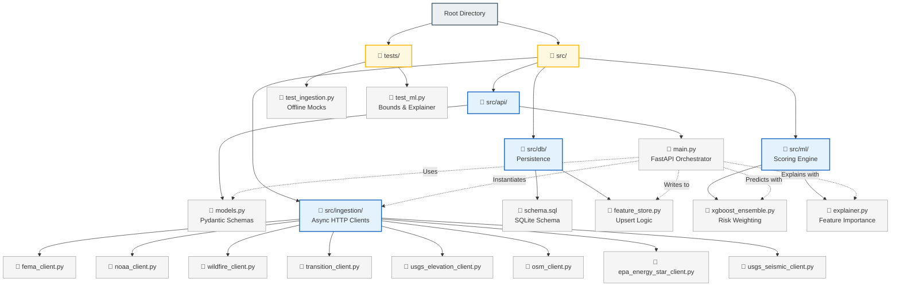

# Codebase Architecture

This diagram maps out the directory structure and module responsibilities of the `ClimateNexus` codebase.

> [!TIP]
> **How to view in Draw.io:**
> Draw.io natively supports importing Mermaid code and will automatically arrange the boxes perfectly! 
> 1. Copy the code block below (starting from `graph TD`).
> 2. Open [Draw.io](https://app.diagrams.net/).
> 3. Go to **Arrange** -> **Insert** -> **Advanced** -> **Mermaid...**
> 4. Paste the code and click **Insert**.

